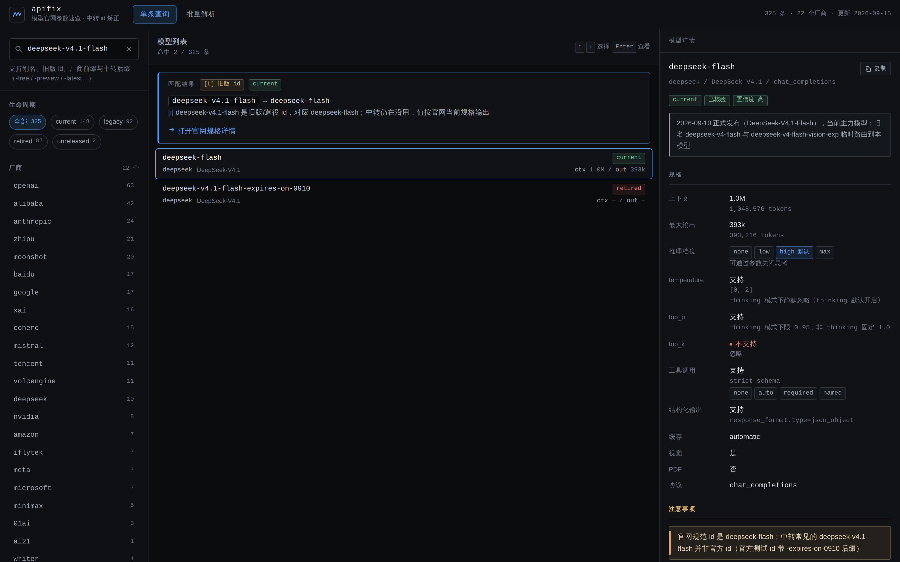
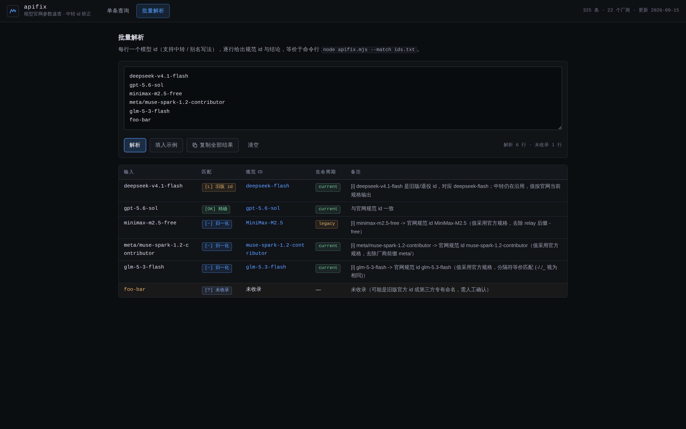

# apifix

[中文](README.md) | [English](README.en.md)


Give it a model ID — usually a legacy name a relay kept alive — and get back the **official spec** plus a
paste-ready config snippet for opencode or pi.

Zero dependencies; configs are read locally only, on demand (`audit` / `fix` / `protocols`). The only network
request in the whole project is `login`'s model auto-detection (which only hits the base URL you type in);
everything else stays offline.

## Why you need this

- **Relays keep official IDs but pair them with wrong numbers.** The official ID itself is stable, yet relays
  fill in context / max output themselves, those values drift as upstream changes, and nobody ever re-checks
  that one line in the client.
- **The numbers in your config are usually wrong or stale.** Relays fill in context / max output themselves,
  those values drift as upstream changes, and nobody ever re-checks that one line in the client.
- **"Dumbing down" happens silently.** In thinking mode, `temperature` is simply ignored, `top_p` has a floor,
  and unsupported effort levels quietly collapse into other levels. Behavior changed — your config won't tell you.
- **Switching models means reading 22 vendors' docs.** Every vendor draws the lines differently for reasoning
  levels, sampling constraints, caching, and tool calling.
- **apifix does one thing**: lay out the official spec and generate a snippet. Undocumented values are `null`.
  It never guesses.

## A real example

A relay config for `gpt-6-astra`, against the official spec:

| Field | Your config | Official spec |
| --- | --- | --- |
| context | 1,000,000 | 1,050,000 |
| max output | 200,000 | 128,000 |
| effort levels | low/high/max | low/medium/high/xhigh/max |
| temperature | true | not customizable |

Four fields, four discrepancies. Relay-filled numbers drift with upstream: max output is inflated one and a
half times, and the **effort list is missing `medium` and `xhigh`** — under this config you can never reach
the official middle reasoning tiers.

Now the "dumbing down" angle: OpenAI **does not support custom** `temperature`/`top_p` for `gpt-6-astra` at
all (values are ignored), tool calling requires the Responses API (Chat Completions doesn't support tools),
and **input above 272K tokens is billed entirely at 2x input / 1.5x output** — a long-context bill doubles
overnight. All of this surfaces in apifix's gotchas and in the generated snippets.

## Quick start

Install straight from GitHub (recommended — you get a global `apifix` command):

```bash
npm install -g github:xlong-c/apifix
apifix gpt-6-astra                     # works immediately; no dependency install needed (zero deps)
```

Or clone and run from source:

```bash
git clone https://github.com/xlong-c/apifix && cd apifix    # no npm install needed: zero dependencies
node apifix.mjs gpt-6-astra            # opencode snippet by default (key stays the ID you typed)
npm start                              # = node apifix.mjs --ui, opens the local Web UI
```

For development, `npm link` gives you a global command pointing at your working copy (edits take effect
immediately).

Common commands:

```bash
node apifix.mjs <id>                   # opencode snippet; stdout is pure JSON, notes go to stderr
node apifix.mjs <id> --emit pi         # pi snippet; also codex|claude-env|curl|sdk
node apifix.mjs <id> -f                # full mode: adds family/status/modalities/cost, etc.
node apifix.mjs <id> --card            # box card: full spec table + gotchas + sources
node apifix.mjs <id> --json            # raw catalog entry (every field)
node apifix.mjs <id> --name "GPT-6 Astra" # override the display name in the snippet
node apifix.mjs <id> --canonical-id    # key uses the canonical ID (e.g. gpt-6-astra-free → gpt-6-astra)
node apifix.mjs --list                 # all IDs grouped by vendor; --list --json for scripts
node apifix.mjs --match ids.txt        # batch-match a file, one verdict per line
node apifix.mjs fix <file> --dry-run   # preview config fixes (y applies / --yes for scripts)
node apifix.mjs login opencode         # interactive provider setup (baseURL / protocol / key / models)
node apifix.mjs --version | --help
```

Exit codes: `0` success, `1` unmatched, `2` usage or file error.

### Protocol overview (`protocols`)

One command to see **which protocol every provider in every tool config actually speaks**, checked
against each model's native protocol:

```bash
node apifix.mjs protocols            # auto-scans ~/.config/opencode, ~/.pi, ~/.claude, ~/.codex
node apifix.mjs protocols --json     # machine-readable; --no-defaults scans only --file paths
```

A protocol mismatch means the relay must translate, so parameters like `thinking`/`temperature` can
be silently dropped ("dumbed down"). The report marks each row `✓ match` / `⚠ native X (translation
required)` / `? protocol uncertain` and summarizes mismatching providers at the end.
Supports opencode (`npm` + `baseURL` inference), pi (`api` field), claude-code
(`ANTHROPIC_BASE_URL`), and codex (`wire_api` in `config.toml`); multi-protocol pipe values (e.g.
`chat_completions|responses|anthropic_messages`) count as a match for any listed protocol.

### Config repair (`fix`)

Turn the discrepancies `audit` reports back into the official spec with one command: it shows a diff plan,
then asks `[y/N]` — `y` applies, `n` cancels.

```bash
node apifix.mjs fix opencode                 # ~/.config/opencode/opencode.json
node apifix.mjs fix pi                       # ~/.pi/agent/models.json
node apifix.mjs fix ./my-config.json         # any file: opencode / pi format auto-detected
node apifix.mjs fix opencode --dry-run       # show the diff plan only, write nothing
node apifix.mjs fix opencode --yes           # skip the [y/N] prompt (for scripts)
```

Only fields documented on the official spec are changed (opencode's `limit.context`/`limit.output`/
`reasoning`/`temperature`/`tool_call`/`attachment`/`variants` (effort levels); pi's `contextWindow`/
`maxTokens`/`reasoning`/`thinkingLevelMap`/`input`). Fields your config doesn't declare are left alone;
undocumented values are never guessed — they are skipped with a note. **Credentials (`apiKey`/`token`) are
never touched and never echoed.** Before writing, a backup is saved as `<file>.bak-<timestamp>`; the write
is an atomic replace (tmp + rename) followed by automatic re-verification. `--json` gives machine-readable
output, and `--no-backup` turns the automatic backup off.

Exit codes: `0` fixed or nothing to fix, `1` differences exist but were not applied (cancelled / `--dry-run`),
`2` usage or read error.

### Add a provider (`login`)

A guided wizard that writes a new provider into your opencode config: provider name → base URL → API
protocol → API key (entered silently, never echoed) → model selection → set as default (optional) →
confirm and write.

```bash
node apifix.mjs login opencode            # interactive wizard, writes ~/.config/opencode/opencode.json
node apifix.mjs login opencode myrelay    # pick the provider name up front
```

Model selection **auto-detects** by default: it requests `{baseURL}/models` (5s timeout) and lists the
available IDs for numbered selection; on failure or with `--no-fetch` it falls back to manual input. Matched
models automatically carry the official catalog spec (unmatched ones get a minimal `{name: id}` entry you can
repair later with `apifix fix`). An existing provider with the same name asks before overwriting; in
non-interactive mode, supply `--base-url`/`--api-key`/`--model` to skip all prompts (for scripts; writing
still requires `--yes`).

```bash
# one-shot non-interactive (scripts / CI)
node apifix.mjs login oc myrelay --base-url https://api.example.com/v1 \
  --api-key sk-xxx --model gpt-6-astra,deepseek-flash --yes
```

Writing reuses fix's safety pipeline: automatic backup, atomic replace, post-write re-verification; the API
key lands only in `options.apiKey` and every output (including `--json`) shows a mask. This is the **only**
command in the project that makes a network request (and only to the base URL you entered); everything else
stays offline.

Exit codes: `0` written, `1` cancelled / re-verification mismatch, `2` usage or read error.

## Web UI

```bash
node apifix.mjs --ui                   # defaults to http://127.0.0.1:7788/
node apifix.mjs --ui --port 8000 --no-open
```



- **Single lookup**: three panes — filters by vendor / lifecycle on the left, a result list with match cards in
  the middle, and details on the right (spec table, gotchas, opencode / pi snippet tabs with a
  **minimal / full** toggle).
- **Batch parse**: paste a list of IDs and get a match verdict plus the resolved entry for each line.



It binds `127.0.0.1` only and serves just `/`, `/ui/*`, `/lib/*`, and `/catalog.json`. If the port is taken it
retries at +1 (up to +10).

The UI is **fully static** (`ui/` + `lib/core.mjs` + `catalog.json`), so publishing the repo root as a site root
is enough to run it on GitHub Pages: the root `index.html` redirects to `/ui/`.

## Coverage

325 entries across 22 vendors:

| vendor | count | vendor | count | vendor | count |
| --- | ---: | --- | ---: | --- | ---: |
| openai | 63 | anthropic | 24 | alibaba | 42 |
| zhipu | 21 | moonshot | 20 | baidu | 17 |
| google | 17 | cohere | 15 | mistral | 12 |
| tencent | 11 | volcengine | 11 | deepseek | 10 |
| nvidia | 8 | amazon | 7 | iflytek | 7 |
| microsoft | 7 | meta | 7 | xai | 16 |
| minimax | 5 | 01ai | 3 | ai21 / writer | 1 each |

Lifecycle: `current` 148, `legacy` 92, `retired` 82, `unreleased` 2 (plus 1 unlabeled). 305 entries are verified against official docs.

**Pricing**: 229 models carry official USD pricing (per 1M tokens). Non-USD prices are converted at merge time
using a fixed reference rate of 1 USD = 7.2 CNY, with the original values kept in `cost.note`. That rate is a
reference, not a live quote.

## Matching rules

Tried in order: **canonical ID → aliases → legacy_ids** → strip vendor prefix (`openai/`, `anthropic/`, `meta/`,
`google/`, `x-ai/`, `deepseek/`, `moonshotai/`, `z-ai/`, `qwen/`, `minimax/`, and more) → strip relay suffix
(`-free`, `-preview`, `-exp`, `-latest`, `-build`, `-contributor`, `-vision-exp`, `-expires-on-*`, `-ga-*`,
`-YYYYMMDD`, `-vN`) → separator-insensitive (`-`, `.`, `_` are equivalent, so `gpt_6_astra` hits
`gpt-6-astra`) → fuzzy fallback (similarity ≥ 0.75, suggestion only).

`--match` labels: `[OK]` exact, `[A]` alias, `[L]` legacy, `[~]` normalized, `[?]` unmatched.
Notes go to **stderr** only, so stdout stays paste-ready:

```
[i] gpt-6-astra-free -> 官网规范 id gpt-6-astra（值采用官方规格，去除 relay 后缀 -free）
```

Note: `-free` is a **third-party / relay convention** (OpenCode Zen, AIHubMix, and others; OpenRouter uses the
colon form `:free`). It is **not** a vendor naming convention — official low-cost tiers get their own model names
(such as `gpt-5.4-mini`, `gpt-5.4-nano`).

## Full mode (`-f`)

By default only 7 core fields are emitted. `-f` adds every derivable field the catalog can supply: `opencode`
gains `family`, `status` (`current`→active / `legacy`/`retired`→deprecated / `unreleased`→beta), `modalities`
(input derived from `vision`/`pdf`), and `cost` (when official pricing exists); `pi` gains `api`
(`anthropic_messages`→anthropic-messages, `responses`→openai-responses, `chat_completions`→openai-completions;
`native`/`gemini`/null are omitted).

`cost` is always **USD per 1M tokens** (`input`/`output`/`cache_read`/`cache_write`/`context_over_200k`, with
null keys omitted; if either `input` or `output` is missing, `cost` is omitted entirely). Fields the catalog has
no official data for (opencode's release_date/interleaved/experimental/options/headers, pi's
provider/baseUrl/compat/cost) are **omitted**, with a single `[i]` note on stderr — that note is dynamic, so
`cost` drops out of the list once it is emitted.

`-f` applies only to `--emit opencode|pi` (other targets print a notice and ignore it);
`--card`/`--json`/`--list`/`--match` already show complete data.

```bash
node apifix.mjs gpt-6-astra -f                 # full opencode mode (with cost)
node apifix.mjs gpt-6-astra --emit pi -f       # full pi mode
```

## Data provenance and trust

- **Only vendor-official docs** (model pages, API docs, pricing pages). Aggregators, relay dashboards, and
  forums are not sources.
- **`null` means "not documented"**, not zero; it renders as `未知/not documented`. Better empty than invented.
- **`verified`**: `true` means every field was checked against official docs (305/325); `false` means the source
  is indirect or pending, and the card says so explicitly.
- **`confidence`** (`high`/`medium`/`low`) works together with `sources`, so every value is traceable.
- Lifecycle and `legacy_ids` record retirements and relay-reused IDs; **retired models show their pre-retirement spec**.

Known limitations: the catalog is a static snapshot and does not auto-update; fuzzy matching only suggests, it
never auto-corrects; `ark-code-latest` is a routing alias whose real spec depends on the console selection; keys
in `curl`/`sdk` snippets need environment variables you set yourself.

## Project layout

```
apifix/
├── apifix.mjs        CLI + local UI server (zero dependencies)
├── lib/core.mjs      Shared core (pure ESM, importable in the browser)
├── ui/               Web UI (fully static)
├── catalog/          Source of truth: one file per vendor (catalog/<vendor>.json, edit these)
├── catalog.json      **Generated** bundle built from catalog/ (CLI/UI read this; do not hand-edit)
├── tools/            Build + merge + validate scripts (used by CI)
├── incoming/         Raw research batches (traceable provenance)
├── legacy-python/    Original Python implementation (reference only)
└── skills/           Companion AI skills (model-spec-lookup / catalog-maintain)
```

To change data: edit `catalog/<vendor>.json` → run `npm run build` to regenerate `catalog.json`
(see [CONTRIBUTING.md](CONTRIBUTING.md)).

## FAQ

**Where does the data come from?**
Entirely from vendor-official docs, each entry carrying `sources` links. The raw research batches live in
`incoming/` for traceability.

**Why is my ID unmatched?**
It may be neither an official ID nor a known alias or legacy ID (relay-invented names, for example). Run
`--match` over a file: unmatched lines get the closest candidate. If it's a real model, add it per
[CONTRIBUTING.md](CONTRIBUTING.md).

**Is the pricing accurate?**
Prices come from official pricing pages, are stamped with `as_of`, and carry a `confidence` rating. They are a
**static snapshot**, not real-time; for frequently repriced models, trust your vendor invoice. Non-USD prices are
converted at a 1 USD = 7.2 CNY reference rate, with originals preserved in `cost.note`.

**Does it read or upload my config?**
Locally only, and never over the network: `audit` / `fix` read the config file you point them at, and
`protocols` scans known paths by default (`--file` for explicit paths). Credential fields are stripped at
extraction time and never echoed in any output; `fix` backs up the file before writing.

**How does it relate to cc-switch?**
It doesn't — no dependency either way. The generated snippets paste straight into your relay config, so the two
can be used together.

**How do I add or fix a model?**
See [CONTRIBUTING.md](CONTRIBUTING.md): drop research into `incoming/`, run `npm run merge`, then
`npm run validate` (CI runs it on every push/PR).

## Contributing

New models and corrections to stale specs are welcome. Start with [CONTRIBUTING.md](CONTRIBUTING.md) — the one
rule that matters most: **cite only official docs, and write `null` for anything undocumented.**

## License

[MIT](LICENSE)
